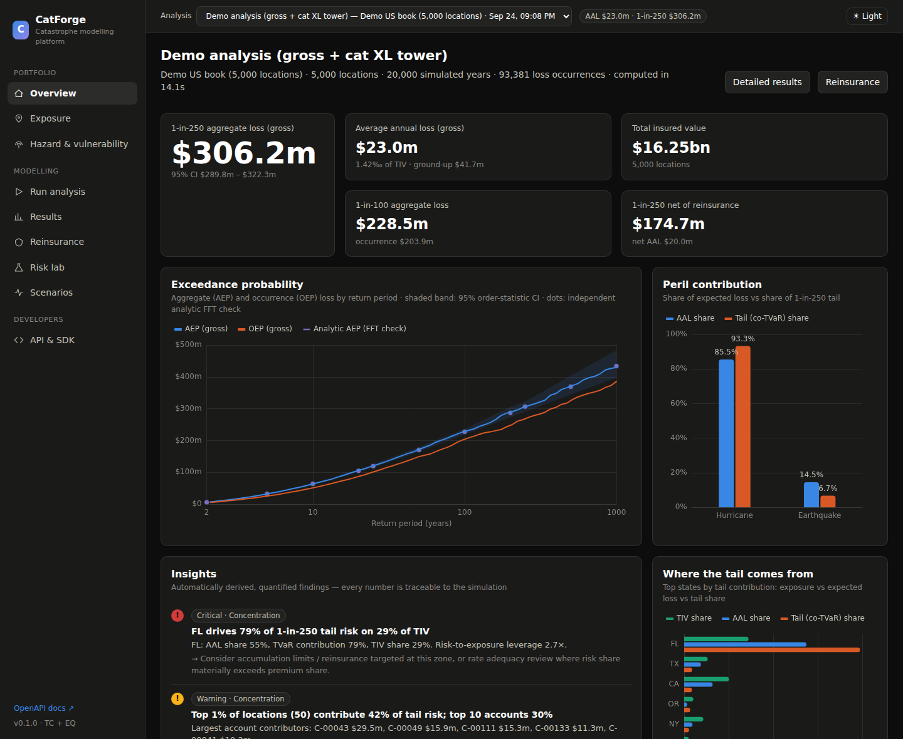
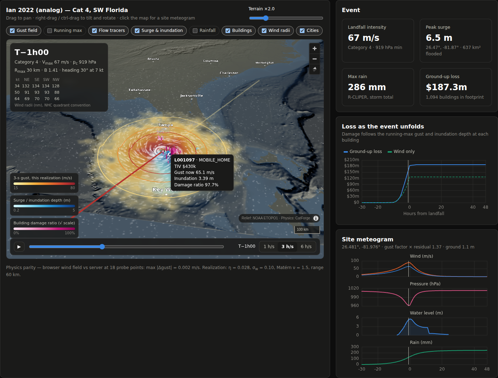
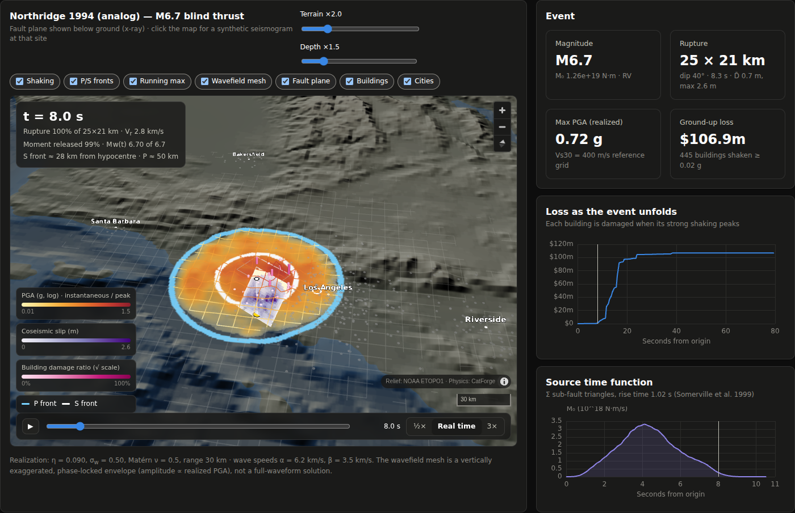
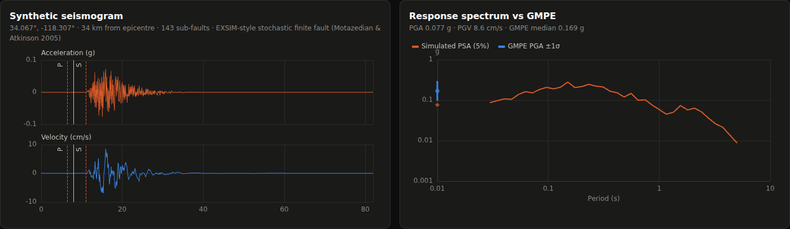
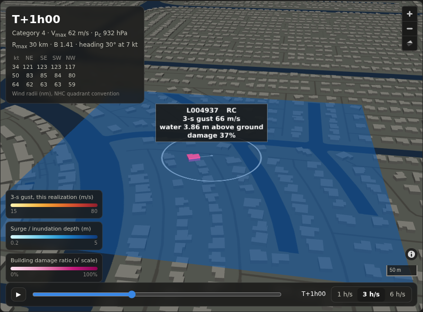
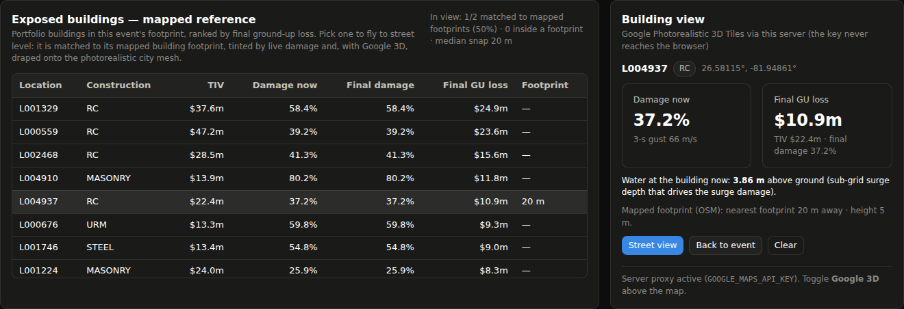
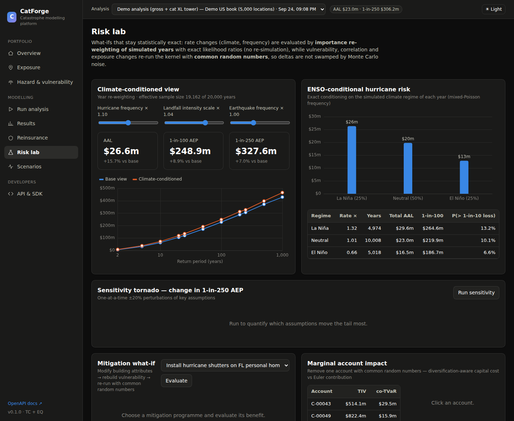

# CatForge — multi-peril catastrophe modelling platform

CatForge is a catastrophe model for property portfolios. It covers hurricane (US Gulf and Atlantic)
and earthquake (US West Coast, Pacific Northwest, Central and South-East US). It is built as three
layers:

1. **A numerically serious engine**: numba kernels, a counter-based RNG, importance-sampled
   catalogs, and an analytic FFT cross-check.
2. **An API-first service**: FastAPI with OpenAPI docs, a Python SDK and a CLI.
3. **An analyst UI**: React, ECharts and Leaflet, with dark and light themes, plus a 3-D event
   development view built on MapLibre and deck.gl.

The engine produces a full distribution of losses, not just point estimates, and turns it into
insights with numbers attached:

- where the tail comes from
- what reinsurance buys
- what climate regimes, model assumptions and mitigation change
- how much sampling noise remains

> **Calibration disclaimer.** The hazard and vulnerability parameters are an *illustrative*
> calibration to public order-of-magnitude statistics (HURDAT-era landfall rates, NGA-style ground
> motions, HAZUS-style fragilities). The architecture and mathematics are production-grade; the
> numbers are placeholders to be re-fitted before any pricing or regulatory use.



## What's inside

| Layer | Highlights |
|---|---|
| **Hazard** | **Hurricane:** landfall-gate stochastic tracks, importance-sampled in both position and intensity; Holland (2008) surface wind field with the Sobey inflow profile and translational asymmetry; Kaplan–DeMaria inland decay; terrain gust factors. **Earthquake:** fault and area sources with truncated Gutenberg–Richter recurrence; finite, dipping planar ruptures (Wells–Coppersmith / Strasser) with R<sub>JB</sub> to the surface projection, which gives hanging-wall effects; BA08-form GMPE with non-linear site terms. **Both:** site hazard curves and return-period maps. |
| **Vulnerability** | Emanuel wind curves and HAZUS-style EQ fragilities. Modifiers for construction, occupancy, year built, storeys, roof shape and shutters. Secondary uncertainty is a zero-one-inflated Beta on damage bins, with within-event hazard uncertainty convolved in analytically. |
| **Financial** | Site deductibles (% of TIV or flat) and limits. Account deductibles, limits, layers and shares. Per-risk XL. Reinsurance programmes with inuring stages: cat XL with reinstatements and AAD/AAL, quota share, stop-loss. Technical pricing by EL + kσ or cost of capital. |
| **Engine** | Numba-parallel kernel driven by a stateless SplitMix64 counter-based RNG, so any draw can be regenerated exactly. **Spatially explicit dependence:** intra-event hazard residuals are a Matérn Gaussian random field, sampled exactly per occurrence with a Vecchia nearest-neighbour GP over precomputed per-event ancestor closures. A light copula couples damage residuals; the legacy two-level copula remains selectable. Mixed-Poisson frequency (gamma × ENSO regimes). Three passes: ELT (event × samples), YLT (occurrences), and an exact tail re-simulation for Euler allocation. |
| **Analytics** | OEP/AEP/TVaR with distribution-free order-statistic CIs. An analytic ELT → PGF → exponentially-tilted FFT EP as an independent check. Euler co-TVaR by any dimension. Stand-alone vs diversified segments. Marginal account impact. Automated, quantified insights. |
| **What-ifs** | Exact year likelihood-ratio reweighting for frequency and intensity (climate) changes, with ESS reported. Exact ENSO conditioning. Common-random-number re-runs for vulnerability, correlation and mitigation. Tornado sensitivity. Instant reinsurance evaluation and an efficient-frontier optimiser. Historical analog and custom scenarios with a full loss distribution. |
| **Event development (4-D)** | One realization of an event resolved in time over ETOPO1 terrain. **Hurricanes:** 2-D shallow-water storm surge with wetting/drying, R-CLIPER rain, the wind field recomputed in the browser from the engine's equations (parity-checked), NHC wind radii, and per-building wind + surge damage. **Earthquakes:** a kinematic finite-fault rupture (von Kármán slip), P/S isochrones, the shaking envelope, and on-demand EXSIM-style seismograms compared with the GMPE. |
| **Interfaces** | REST API (`/docs`), Python SDK (`catforge.client`), in-process library, CLI, and a web UI. |

The full mathematics is in **[docs/methodology.md](docs/methodology.md)**.

### Event development in 3-D

Pick a historical analog or any stochastic event. The server simulates one physically consistent
realization; the browser then plays it back over real terrain and bathymetry.

**Hurricane.** The Holland gust field (3-s, this realization) is evaluated per frame, with tracer
particles advected through it. The view also shows:

- the 2-D surge rising and flooding the coast;
- NHC wind radii per quadrant;
- each building's damage column growing as the running-maximum gust and water depth reach it.

Click anywhere for a meteogram of gust, pressure, water level and rain.



**Earthquake.** The fault plane is drawn below ground in x-ray, lighting up at its rupture times
and coloured by slip. The P and S fronts sweep across the draped terrain, and the moment-rate
function and loss accumulate as the S waves arrive. Click anywhere for a synthetic seismogram and
its response spectrum against the GMPE.




**Mapped building reference: your exposure on real 3-D buildings.** Every exposed location is snapped
to its mapped building footprint (OpenStreetMap, via keyless OpenFreeMap vector tiles). A location
inside a footprint matches it; otherwise the nearest footprint edge within 35 m is taken. The matched
building is tinted by its live damage ratio. Pick any building in the **Exposed buildings** table
(ranked by loss) to fly to street level, where you see:

- the building's live gust or PGA and its damage;
- the geocode-to-footprint offset (a leader line);
- for hurricanes, the flood-water plane at the building's ground plus the modelled inundation depth
  — the same depth that drives its surge damage — rising against the facades as the surge arrives.

The match rate and snap distances also serve as a geocoding-quality check on the portfolio.

With a Google Maps Platform key, the same view renders on **Google Photorealistic 3D Tiles**. The
damage tints and hazard fields are draped onto the photoreal mesh (deck.gl `TerrainExtension`), and
the building's ground height is sampled from the mesh itself.




**Exposure enrichment: building-scale ground and footprints.** One job attaches three things to
each coastal location (or every location):

- USGS 3DEP ground elevation (about 10 m resolution);
- its mapped OSM footprint (area, height, storeys);
- a data-quality report.

Surge depth then uses each building's real ground instead of a 3.7 km DEM cell. On the demo book the
coarse DEM puts coastal buildings a median 1.9 m too high. Correcting it raises Ian's on-land surge
event loss by **+22 %** and Katrina's by **+29 %**, while geocodes found on open water are flagged
separately ([methodology §9.4](docs/methodology.md)).

```python
r = cf.enrich(pid, scope="coastal")        # new portfolio + QA report (match rate, elevation bias, offshore flags)
cf.quality(r["portfolio"]["id"])           # per-location: ground (3DEP) vs 2′ DEM, footprint match, storeys before/after
cf.elevation(26.581, -81.949, lidar=True)  # point ground from ETOPO1, 3DEP tiles and the USGS 1 m lidar service
dev = cf.develop(portfolio_id=r["portfolio"]["id"], analog="ian_2022")  # surge on measured ground
```

Enabling Google 3D (the Map Tiles API must be enabled on the key):

```bash
# recommended: the server relays /v1/3dtiles/* and the key never reaches the browser
export GOOGLE_MAPS_API_KEY=...        # API-restricted to the Map Tiles API (server key: no referrer restriction)
catforge serve
curl localhost:8000/api/integrations  # {"google_3d_tiles": {"available": true, "mode": "server-proxy", ...}}
```

Alternatively, paste a browser key in the **Building view** panel; it is stored only in that browser.
Google's attribution line is shown whenever photoreal tiles are on, and responses are relayed without
caching.

```python
from catforge.client import CatForgeClient
cf = CatForgeClient("http://localhost:8000")
dev = cf.develop(portfolio_id=pid, analog="ian_2022", seed=3)
dev["surge"]["peak_m"], dev["loss"]["gu"][-1]            # peak water level (m), ground-up loss
depth = cf.decode(dev["surge"]["max"]["land_depth_cm"])  # max inundation depth grid (m), NaN = dry
sg = cf.seismogram(34.06, -118.30, analog="northridge_1994")  # acc/vel traces, PSA, GMPE ±1σ
```



## Quick start

```bash
# backend
python -m venv .venv && . .venv/bin/activate
pip install -e ".[dev]"

# frontend (optional — the API works without it)
cd frontend && npm ci && npm run build && cd ..

# run: builds a 5,000-location demo book and a 20,000-year analysis in the background (~20 s cold)
catforge serve --port 8000          # UI at http://localhost:8000, OpenAPI at /docs
```

Or with Docker: `docker build -t catforge . && docker run -p 8000:8000 catforge`.

UI development with hot reload: run `catforge serve` and `cd frontend && npm run dev`, then open
http://localhost:5173. The Vite dev server proxies `/api` to port 8000.

### As a library

```python
from catforge import CatModel, AnalysisConfig, generate_portfolio

model = CatModel.default()                          # TC (4,800 events) + EQ (~3,400 events)
pf = generate_portfolio(5000)                       # or Portfolio.from_csv(open("book.csv").read())
res = model.run(pf, AnalysisConfig(n_years=20000, reinsurance={"contracts": [
    {"name": "150m xs 100m", "type": "cat_xl", "attachment": 1e8, "limit": 1.5e8, "reinstatements": 1}]}))

res.summary["rp_table"]      # AEP/OEP/TVaR with confidence intervals, net of reinsurance
res.elt.head()               # event loss table
res.insights                 # ranked, quantified findings
```

### Via the REST API / SDK

```python
from catforge.client import CatForgeClient

cf = CatForgeClient("http://localhost:8000")
pf = cf.create_synthetic_portfolio(n_locations=20000, states=["FL", "TX", "LA"])
an = cf.run_analysis(pf["id"], n_years=50000)
cf.climate(an["id"], tc_frequency=1.1, tc_intensity=1.05)   # exact re-weighting, no re-simulation
cf.optimise_reinsurance(an["id"])                            # efficient frontier
cf.sensitivity(an["id"])                                     # CRN tornado
cf.scenario(pf["id"], analog="cascadia_m90")                 # deterministic event, 1,000 realisations
```

### CLI

```bash
catforge portfolio --n 10000 --states FL TX --out book.csv
catforge run --portfolio book.csv --years 50000 --reinsurance program.json --out results/
catforge hazard-curve --peril EQ --lat 34.05 --lon -118.24
catforge scenario --analog andrew_1992 --portfolio book.csv
```

## Exposure format

CSV files are read with an OED-inspired schema. Common OED aliases are accepted, for example
`Latitude`, `BuildingTIV`, `ConstructionCode` and `AccNumber`.

- **Required:** `lat`, `lon`, `tiv_building`.
- **Optional:**
  - identifiers: `loc_id`, `acc_id`, `state`, `lob`
  - building: `construction`, `occupancy`, `year_built`, `stories`
  - other coverages: `tiv_contents`, `tiv_bi`
  - site terms: `ded_tc`, `ded_eq` (a value ≤ 1 means a fraction of TIV), `loc_limit`
  - site conditions: `terrain`, `vs30`, `roof_shape`, `shutters`
  - account terms: `acc_ded`, `acc_limit`, `acc_attach`, `acc_layer_limit`, `acc_share`

Validation maps aliases, coerces types, applies defaults and reports problems as warnings.

## API map

| Endpoint | Purpose |
|---|---|
| `GET /api/catalogs`, `/catalogs/{peril}/events`, `/events/{id}`, `/events/{id}/footprint`, `/catalogs/{peril}/stats` | Stochastic catalogs, geometry, footprints, climatology |
| `GET /api/hazard/curve`, `/hazard/map` | Site hazard curves, return-period maps |
| `GET /api/vulnerability/curve` | Damage distribution for any building class |
| `POST /api/portfolios/synthetic`, `/portfolios/upload`; `GET /api/portfolios/{id}[/locations]` | Exposure management |
| `POST /api/analyses` (`?wait=true` for synchronous) | Run an analysis as a background job |
| `GET /api/analyses/{id}`, `/ep`, `/analytic`, `/elt`, `/ylt`, `/locations` | Results (JSON or CSV) |
| `GET /api/analyses/{id}/allocation?dimension=…`, `/segments`, `/insights`, `/enso` | Allocation, diversification, insights, climate regimes |
| `POST /api/analyses/{id}/reinsurance`, `/reinsurance/optimize`, `/reinsurance/apply` | Programme evaluation, frontier, persist |
| `POST /api/analyses/{id}/climate`, `/sensitivity`, `/mitigation`, `/marginal` | What-ifs |
| `POST /api/scenarios/run`; `GET /api/scenarios/analogs` | Deterministic events and historical analogs |
| `POST /api/develop` (`?wait=true`) | Time-resolved development of one event realization (surge, rain, rupture, per-building damage) |
| `POST /api/develop/seismogram` | EXSIM-style synthetic seismogram and PSA at any site |
| `GET /api/terrain/{z}/{x}/{y}.png` | ETOPO1 terrain/bathymetry as Terrarium tiles |
| `POST /api/portfolios/{id}/enrich`, `GET /api/portfolios/{id}/quality` | Exposure enrichment (3DEP ground, OSM footprints) → new portfolio + QA |
| `GET /api/geodata/elevation` | Point ground elevation: ETOPO1 vs 3DEP tiles vs USGS 1 m lidar point service |
| `GET /api/integrations` | Which map integrations are available (Google 3D Tiles proxy, OSM vector tiles); never returns secrets |
| `GET /v1/3dtiles/…` | Pass-through for Google Photorealistic 3D Tiles (server key; only the 3D Tiles tree is reachable) |
| `GET /api/jobs/{id}` | Job progress and results |

## Validation & performance

These numbers come from the 5,000-location demo book ($16.25bn TIV), with 20,000 years, run on
4 vCPUs.

**Convergence checks**

- **AAL:** the three independent estimators agree. YLT gives $23.0m, the ELT gives $23.2m, and the
  analytic FFT gives $23.2m.
- **AEP curve:** simulated and analytic (FFT) agree within about 2% from the 1-in-50 to the 1-in-1000.
- **Euler allocation:** co-TVaR contributions sum exactly to TVaR.
- **Tail re-simulation:** re-running the tail years is bit-identical to the original run.

**Timings**

| Stage | Time |
|---|---|
| Cold start (numba compilation, footprints, ELT, YLT, allocation) | ~20 s |
| Warm re-run | ~6 s |
| Hurricane-only run, 10,000 years | ~4 s |
| Reinsurance evaluation | ~15 ms |
| Sensitivity tornado (13 CRN re-runs and re-weightings) | ~7 s |

**Physics validation**

- **Storm surge:** peak coastal water level against the historical record gives a median ratio of
  about 0.96 (Hugo 5.9 vs 6.0 m, Michael 4.9 vs 4.7 m, Sandy 2.7 vs ≈2.9 m). The full table and the
  known sub-grid misses are in the methodology.
- **Random fields:** the Vecchia field with m = 30 reproduces Matérn correlations to within 0.013–0.026.
- **Wind:** the browser and server wind fields agree to about 0.002 m/s.

**Tests:** `pytest` runs 66 tests covering the hazard physics, random fields, the surge solver
(the analytic set-up and mass conservation), rupture kinematics, the Google 3D Tiles proxy, the PNG/MVT decoders and the enrichment pipeline, the maths identities, the financial
terms, reinsurance path logic, the API and the SDK.

## Project layout

```
catforge/
  hazard/         tropical_cyclone.py · earthquake.py · footprint.py · base.py (catalogs, mixed-Poisson)
  vulnerability/  damage.py (curves, zero-one-inflated Beta bins, convolution, tables)
  exposure/       portfolio.py (schema/validation/IO) · synthetic.py
  financial/      terms.py · reinsurance.py (programmes, pricing, optimiser)
  engine/         kernel.py (numba loss kernel) · ylt.py · model.py (orchestration)
  analytics/      ep.py · analytic.py (FFT) · allocation.py · sensitivity.py · insights.py
  api/            app.py · schemas.py · store.py (jobs, persistence)
  api/tiles3d.py  Google Photorealistic 3D Tiles pass-through + /api/integrations
  geodata/        fetch.py (cached concurrent tiles) · png.py · mvt.py (in-house decoders) · terrain.py (3DEP)
                  buildings.py (OSM footprint matching) · enrich.py (enrichment pipeline + QA)
  physics/        grf.py (Matérn, Vecchia, circulant) · surge2d.py · tc_dynamics.py · eq_dynamics.py
                  dem.py (ETOPO1, terrain tiles) · develop.py (4-D event payloads)
  scenario.py · client.py · cli.py · rng.py · geo.py · data/ (incl. etopo1_2min.npz)
frontend/         React + TypeScript + ECharts + Leaflet; src/dev/ = MapLibre + deck.gl 3-D scenes,
                  footprint matching (footprints.ts), building layers (buildings.ts), Google 3D Tiles (google3d.ts)
docs/             methodology.md
tests/
```

## Where to push next — open problems worth solving together

1. **~~Spatially explicit dependence~~ — done** (Vecchia NNGP with per-event closures; §4.2).
   Next: non-stationary ranges (anisotropic along-track TC correlation, basin effects in EQ) and a
   posterior Vecchia conditioned on observed station data, for real-time event response.
   **Surge next:** subgrid-corrected SWE (Kennedy et al. 2019) to capture bay funnelling
   (Biscayne, Narragansett), wave set-up, and coupling surge frames directly into the engine's surge
   peril.
2. **Event-set compression.** Choose a weighted subset of events that preserves the portfolio EP to
   ±x% at chosen return periods. This can be framed as a quadrature or optimal-transport problem on
   the loss distribution, or as loss-based importance sampling with a variance-optimal proposal.
   The payoff is 10–50× faster pricing loops.
3. **Tail-optimal simulation.** Target variance reduction at the 1-in-250 rather than at the AAL:
   cross-entropy importance sampling over (event, η, Z), or multilevel splitting on annual loss.
   Can the same CI width be reached with 10× fewer years?
4. **Clustering beyond regimes.** Model within-season TC clustering with a Hawkes or Cox process
   driven by a latent SST/steering state, then fit it by maximum likelihood to HURDAT. How do
   reinstatement and aggregate-cover prices move relative to the mixed-Poisson baseline?
5. **Capital allocation beyond TVaR.** Use spectral or distortion risk measures (Wang transform,
   proportional hazards) for allocation. Kernel-smoothed co-VaR gradients with CRN would give
   capital-consistent risk-adjusted pricing per account.
6. **Structure optimisation as a real optimiser.** Replace the grid with gradient-based optimisation
   of a multi-layer tower. Loss is piecewise linear in (A, L), so subgradients over the simulated
   occurrences are available, giving a convex-in-practice programme for minimum cost at a target
   net VaR/TVaR.
7. **Calibration pipeline.** Fit the landfall climatology to HURDAT2, fit vulnerability to claims
   (a Bayesian hierarchical model over construction × code era), and run posterior-predictive checks
   against historical industry losses. Epistemic uncertainty then propagates as an outer loop,
   giving the "EP of EPs".

## License

MIT
